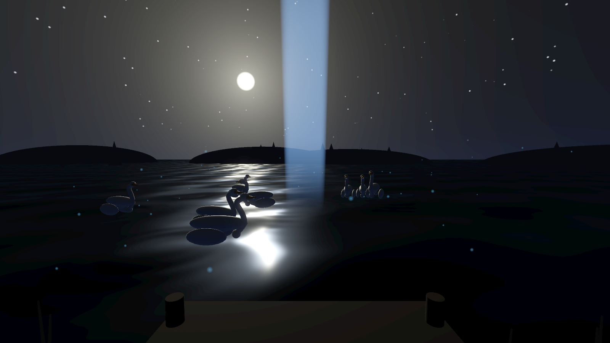
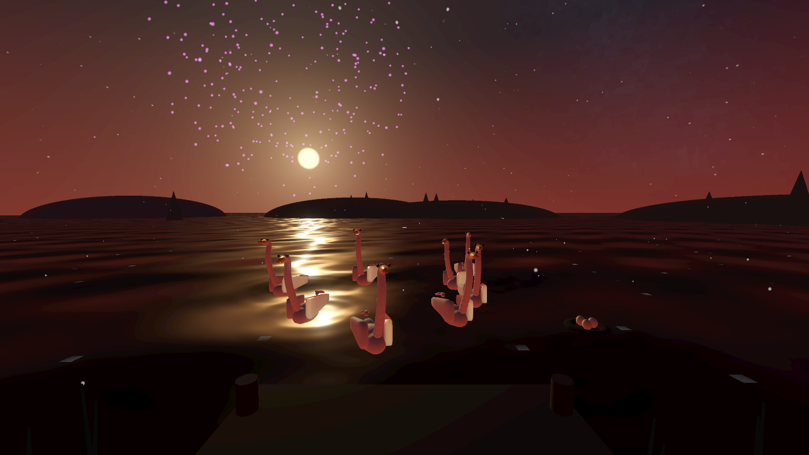
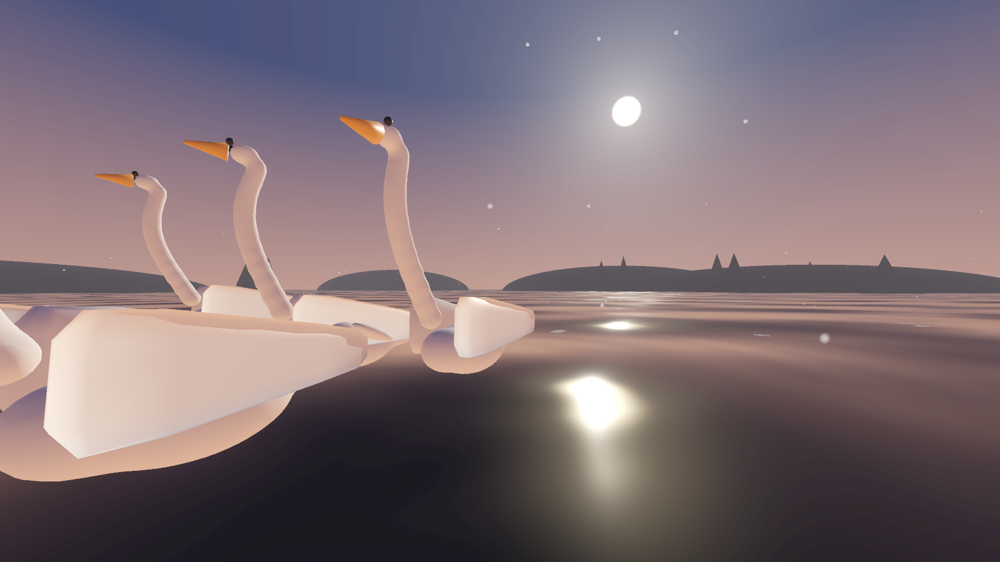
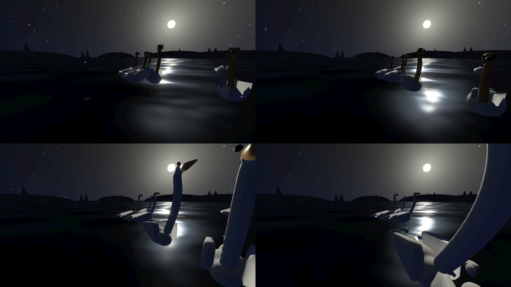
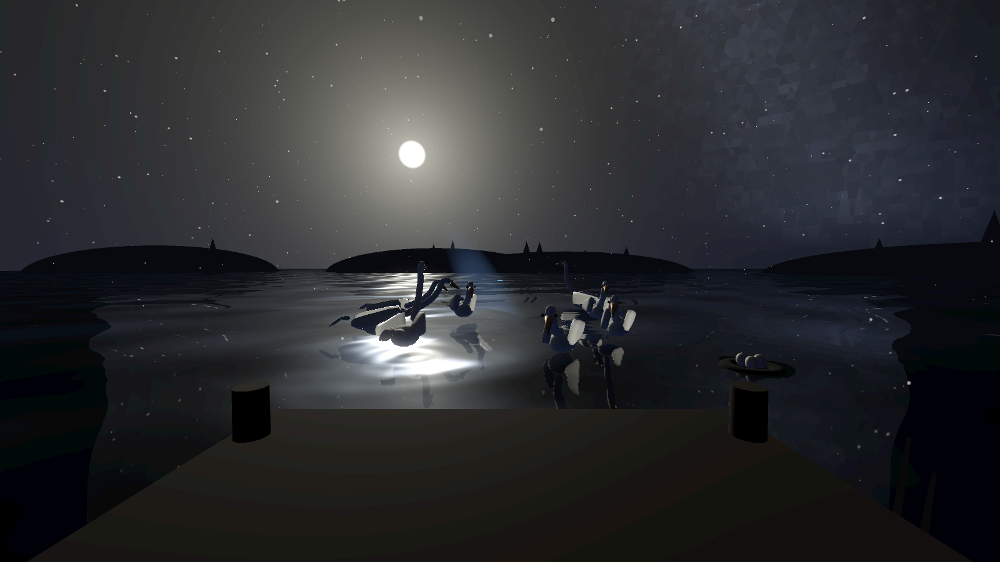
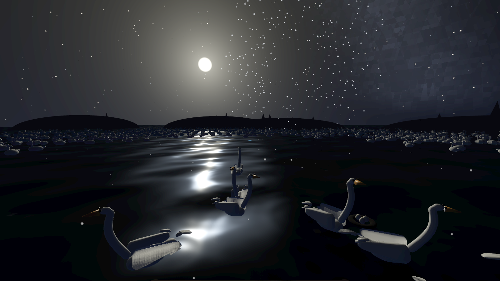

# Swan Lake XR

*Swan Lake, on the Swan.* An immersive twilight-lake vignette built by [Agile Lens](https://agilelens.com) for PICO's next-generation **Swan** headset — and any OpenXR standalone device.

You stand on a wooden dock over a moonlit lake. Swans glide past, leaving real wakes in the water. Tchaikovsky's *Swan Lake* (a verified public-domain recording) swells around you, and your controller is a conductor's baton: ripple the water, draw the flock into a moonbeam, light the stars of Cygnus, hatch a cygnet, and end the night with fireworks over the water.



Built entirely with **Godot 4.7 + the OpenXR Vendors plugin**, 100% procedural assets (Blender-scripted models, synthesized-in-key sound effects, shader water/sky), packaged headlessly on macOS. No engine GUI was opened in the making of this app.

## Experience

- **Conduct.** Right trigger ripples the water where you point — the flock banks toward it. Ripple sounds are pitched to B minor and quantized to the music's pulse. The baton's grip angle is tunable in the headset — five presets, plus the right stick to dial it live.
- **Fish sing.** Leaping fish play plucked harp notes in B natural minor, walking up the scale as they go, answered an octave down when they re-enter the water. Every note is tuned to within half a cent of the score's key.
- **Gather.** Hold grip: the swans assemble in a moonbeam (angled from the actual moon), face you, and bow. Hold long enough and the Act 4 finale takes over.
- **Finale.** Act 4 swells, fireworks bloom over the lake in mood-matched palettes, fish leap in choreography, and the night closes with a title card.
- **Moods.** Night / Dusk / Dawn — three complete palettes (sky, water, fog, fireflies, firework colors), tweened live.
- **Weather.** Clear / Snow / Rain / Breeze — rain patters real ripples across the water.
- **Swan styles.** Four model tiers from flat-shaded origami to layered-feather detailed, hot-swappable at runtime.
- **Synesthesia.** Fireflies shift color and pattern with your conducting energy and the orchestra's dynamics; a Fantasia-style sparkle trail follows your baton. With hand tracking, pinch modulates the response.
- **Easter eggs.** Find and light the seven stars of **Cygnus, the Swan** (each is a chime note in key). Complete the constellation and watch what happens at the nest.
- **Reflections.** Four water-reflection techniques (analytic / probe / planar / planar stereo) behind a live toggle. Stereo renders a mirrored camera per eye, so reflections sit at the right depth instead of being pasted flat across both.
- **Corps de ballet.** A stress-test mode that fills the outer lake with up to 5,000 additional swans — two `MultiMeshInstance3D`s (a nicer near mesh, a flat far mesh) keep it at two draw calls total regardless of count, with per-instance bob/sway running in a vertex shader and only a rotating batch of instances re-positioned per frame. Swells in automatically for the Act 4 finale, and it's the first thing the performance governor sheds if frame rate dips — a direct answer to "can the Swan handle a bazillion swans?"
- **Performance governor.** Watches frame rate and sheds effects one notch at a time to hold the target — corps size first, then reflections, shadows, sparkles, and MSAA.

## Controls

| Input | Action |
|---|---|
| Right trigger | Conduct: ripple burst + attract flock (also taps stars / eggs / menu orbs) |
| Left trigger | Launch a firework where you point |
| Either grip (hold) | Gather the flock into the moonbeam |
| Right A | Cycle mood (Night / Dusk / Dawn) |
| Right B | Trigger the Act 4 finale |
| Left X | Cycle weather |
| Left Y | Settings orbs (swan style, corps size, mood, weather, reflections, shadows, sparkles, baton pose, SFX timing, FPS HUD) |
| Right stick (menu open) | Fine-tune the baton grip angle — saved between sessions |

Put the controllers down and the piece keeps going on hand tracking alone — the hands and baton follow your real hands, and pinch carries the verbs:

| Bare-hand gesture | Action |
|---|---|
| Right pinch | Conduct: ripple + attract the flock |
| Left pinch | Launch a firework |
| Both pinch (hold) | Gather the flock into the moonbeam |

Pick a controller back up and it takes over instantly — a tracked controller always wins.

Desktop preview (no headset): mouse-look + `1/2/3` mood, `SPACE` ripple, `G` gather, `F` finale, `K` firework, `W` weather, `R` reflections, `S` swan style, `X` corps size, `B` baton pose, `T` SFX timing, `M` orb menu, `C`/`N` easter-egg cheats, `H` FPS HUD, `P` screenshot.

## Build

Requirements: Godot 4.7.1 + export templates, the godot_openxr_vendors 5.1.0 addon (bundled in `project/addons/`), Android SDK (build-tools 35+), JDK 17. Blender 4/5 and Python 3 + numpy regenerate the assets from `assets_src/` — every model and sound is code.

```bash
python3 assets_src/make_sfx.py    # re-synthesize the SFX kit (harp, chimes, plops, loops)
```

```bash
python3 tools/measure_tempo.py project/assets/music/*.ogg    # tempo + beat-grid phase per track
```

`measure_tempo.py` reports *ranked* tempo candidates rather than one number: a rubato orchestral recording genuinely supports more than one reading, and the Act II Scène's tempo octave is ambiguous even to two different scoring metrics. Pick the family that matches the score and put it in `music.gd`'s `TRACKS`.

```bash
./build.sh pico    # → out/SwanLake_pico.apk   (PICO OpenXR loader)
```

```bash
./build.sh quest   # → out/SwanLake_quest.apk  (Meta loader, same scene)
```

Install to a device in developer mode:

```bash
adb install -r out/SwanLake_pico.apk
```

Desktop look-dev:

```bash
<godot-binary> --xr-mode off --path project -- --preview
```

`--xr-mode off` matters: with the hand-tracking extensions enabled, OpenXR will happily create a real session on a desktop that has an OpenXR runtime installed, starve the frame loop, and bury the log in *"no viewport was marked with use_xr"*.

## Things to Try

1. **Stand still for a minute at night.** Watch a swan preen, the moon streak breathe with the music, and fireflies drift through the reeds.
2. **Hold grip until the music changes.** The gather-bow held long enough triggers the finale — fireworks included.
3. **Look up and trace the Swan.** Seven stars pulse faintly overhead. Light all of Cygnus and follow the shooting star to the nest.
4. **Open the orbs (left Y) and flip swan styles.** Origami → low-poly → organic → detailed, live, mid-glide.
5. **Set weather to rain, reflections to planar stereo.** Rain rings on mirror-water at dusk is the screenshot you'll send someone — and in stereo the reflections sit at the right depth.
6. **Dial in the baton.** Open the orbs, aim at *Baton*, and push the right stick up or down until the wand sits in your hand the way you'd actually hold one. It remembers.
7. **Push the corps to 5,000.** Open the orbs, aim at *Corps*, and cycle it up. Watch the FPS HUD (also in the orbs) — the performance governor will pull it back down the instant frame rate needs it, so you can't actually break the experience by asking for too many swans.

## Screenshots

| | |
|---|---|
|  |  |
|  |  |
|  | |

## Credits

Music: Tchaikovsky, *Swan Lake* Op. 20 — public-domain recording via Wikimedia Commons (see [CREDITS.md](CREDITS.md)). Engine: Godot (MIT). XR loaders: godot_openxr_vendors (MIT). Everything else: © Agile Lens, released under the [MIT License](LICENSE).

Built by **Agile Lens** — real-time immersive design, NYC.
